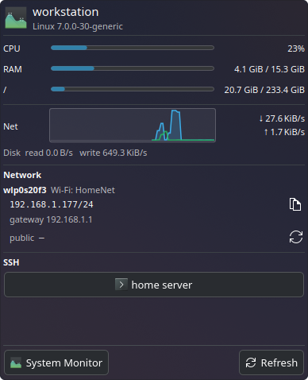

<h1 align="center">System Glance</h1>

<p align="center">
  <strong>CPU, RAM, disks, network and IP addresses at a glance, right from your KDE Plasma panel.</strong><br>
  One panel icon opens live meters, a network sparkline, every interface's addresses and one-click SSH sessions.
</p>

<p align="center">
  <a href="https://github.com/Velidoran/systemglance/actions/workflows/ci.yml"></a>
  <a href="LICENSE"></a>
  
  
</p>

<p align="center">
  <a href="#install">Install</a> ·
  <a href="#configure">Configure</a> ·
  <a href="#privacy-and-permissions">Privacy</a> ·
  <a href="#development">Development</a> ·
  <a href="CONTRIBUTING.md">Contributing</a>
</p>

<p align="center">
  
</p>

## Features

- **Meters at a glance:** CPU, RAM, optional swap and the usage of each mounted filesystem, as bars.
- **Network sparkline:** about 90 seconds of download (blue, filled) and upload (green) history beside the live ↓/↑ rates, plus disk read and write rates.
- **Every interface:** the Wi-Fi network name or link state, IPv4 and global IPv6 addresses with copy buttons, and the default gateway.
- **Public IP on demand:** fetched from `api.ipify.org` only when you click for it, with a copy button. You can hide the row.
- **One-click SSH:** a button per host opens your terminal already running `ssh user@host`.
- **Light on your system:** plain QML with no build step. The stats come from Plasma's own `ksystemstats`, and the address, Wi-Fi and disk commands run only while the popup is open.

## Requirements

- KDE Plasma 6
- `ksystemstats`, which ships with Plasma and provides the CPU, RAM, network and disk sensors
- `ip` (iproute2) and `df` (coreutils); `nmcli` (NetworkManager) for the Wi-Fi network name; `curl` only for the public IP lookup
- A terminal emulator for the SSH buttons: `konsole` by default

## Install

### From a release

1. Download `systemglance-<version>.plasmoid` from the [latest release](https://github.com/Velidoran/systemglance/releases/latest).
2. Right-click the panel → **Add Widgets…** → **Get New** → **Install Widget From Local File…**, and pick the file. Or install it from a terminal:

   ```sh
   kpackagetool6 --type Plasma/Applet --install systemglance-1.0.0.plasmoid
   ```

   To update an existing install, use `--upgrade` instead of `--install`.

### From source

```sh
git clone https://github.com/Velidoran/systemglance.git
cd systemglance
./install.sh
```

`install.sh` runs `kpackagetool6` to install the widget under `~/.local/share/plasma/plasmoids/com.github.systemglance/`, or upgrades it in place if it's already there.

### Add it to a panel

Right-click the panel → **Add Widgets…** → **System Glance**. To try it without touching the panel:

```sh
plasmawindowed com.github.systemglance
```

After upgrading, a copy already on the panel picks up the new version when Plasma restarts:

```sh
systemctl --user restart plasma-plasmashell
```

### Uninstall

```sh
kpackagetool6 --type Plasma/Applet --remove com.github.systemglance
```

## Configure

Right-click the widget → **Configure System Glance…**

| Setting            | Default      | Notes                                                                               |
| ------------------ | ------------ | ----------------------------------------------------------------------------------- |
| Refresh interval   | 10 s         | How often addresses, the Wi-Fi name and disk usage refresh while the popup is open. |
| Mount points       | `/`          | One per line (`/`, `/home`, …). Leave empty to show every real filesystem.          |
| Show swap          | Off          | Adds a swap usage bar.                                                              |
| Terminal command   | `konsole -e` | Must accept a trailing command to run, e.g. `x-terminal-emulator -e`.               |
| Keep terminal open | Off          | Uses `konsole --hold`, so the window stays open after the SSH session ends.         |
| SSH hosts          | None         | One per line: `label \| user@host \| port`. The port is optional.                   |
| Public IP          | On           | Shows the public IP row and its fetch button.                                       |

CPU, RAM and network rates come from Plasma's sensors and update on their own.

For example, these SSH hosts give you two buttons. A line with just `user@host` works too, and uses that as its label.

```text
home server | pi@192.168.1.20 | 22
work | me@work.example.com
```

## Privacy and permissions

System Glance has no server and collects nothing. Everything in the popup comes from your own machine, apart from the public IP, which it looks up only when you click for it.

| What it runs or reads                                           | When                                                                  |
| --------------------------------------------------------------- | --------------------------------------------------------------------- |
| Plasma's `ksystemstats` sensors (CPU, memory, network, disk IO) | Continuously, once the popup has been opened                          |
| `ip -j addr`, `ip -j route`, `nmcli` and `df`                   | When the popup opens, then every refresh interval while it stays open |
| `curl https://api.ipify.org`                                    | Only when you click the public IP refresh button                      |
| Your terminal running `ssh`, or `plasma-systemmonitor`          | Only when you click an SSH or **System Monitor** button               |

- `nmcli` reads NetworkManager's cached scan results, so the widget never starts a Wi-Fi scan.
- The public IP lookup sends a normal HTTPS request to api.ipify.org, which sees your IP address like any website would. Turn off **Public IP** in the settings to remove the button.
- Wi-Fi network names and disk labels are shown as plain text, never parsed as markup, and the api.ipify.org reply is shown only if it's an IP address.
- Your SSH hosts are kept in Plasma's widget settings on your machine, and SSH sessions run in your own terminal with your normal SSH config and keys.

## Development

There's no build step: the widget is plain QML and JavaScript in [`package/`](package).

```sh
./install.sh                              # install or upgrade from this checkout
plasmawindowed com.github.systemglance    # run it in a window; QML errors print to the terminal
scripts/check.sh                          # shellcheck, metadata.json, config keys and QML syntax
scripts/package.sh                        # dist/systemglance-<version>.plasmoid
```

<details>
<summary>Project layout</summary>

```
package/
  metadata.json                   Plasma 6 applet manifest: id, version, links
  contents/
    config/
      main.xml                    Settings and their defaults
      config.qml                  Registers the settings page
    ui/
      main.qml                    Panel icon and popup wiring
      FullRepresentation.qml      The popup: sensors, shell commands and every section
      NetGraph.qml                Rolling network throughput sparkline (Canvas)
      StatBar.qml                 Reusable "caption | bar | value" row
      ConfigGeneral.qml           Settings page
scripts/
  check.sh                        The checks CI runs
  package.sh                      Builds the .plasmoid for releases
install.sh                        Install or upgrade from a checkout
```

</details>

<details>
<summary>Where the data comes from</summary>

- **CPU, RAM, swap, network rates and disk IO:** `org.kde.ksysguard.sensors` (`cpu/all/usage`, `memory/physical/*`, `memory/swap/*`, `network/all/{download,upload}`, `disk/all/{read,write}`), fed by the `ksystemstats` daemon.
- **Addresses, gateways, Wi-Fi network name and disk usage:** `ip -j addr`, `ip -j route`, `nmcli` and `df`, run through the `org.kde.plasma.plasma5support` `executable` engine on the refresh timer.
- **Public IP:** `curl https://api.ipify.org`, only when you click for it.
- **SSH and System Monitor:** your terminal and `plasma-systemmonitor`, launched through the same `executable` engine.

The sparkline keeps its history in memory only, so it starts empty each time Plasma starts.

</details>

## Contributing

Bug reports, ideas and pull requests are welcome. See [CONTRIBUTING.md](CONTRIBUTING.md) for the development setup, code style and how releases work. Please report security issues privately as described in [SECURITY.md](SECURITY.md), and follow the [code of conduct](CODE_OF_CONDUCT.md).

## License

Released under the [MIT License](LICENSE).
